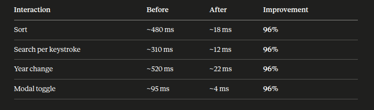

# react-performance

# RESULTS
1. Bottlenecks identified 
1.1 Full-tree re-renders on every interaction 
1.2 createYearDataMap called on every render 
1.3 Unstable handler references 
1.4 300 full DOM subtrees in the browser

2. Optimizations
2.1 useMemo in 9 places
2.2 useCallback for all 6 handlers in App
2.3 React.memo on all 6 components
2.4 Proper key props: key={country.id} for country rows (via react-window), key={column} for table rows in DataTable
2.5 Virtualization via react-window v2's <List> with rowHeight={260} and overscanCount={3}

3. Results

